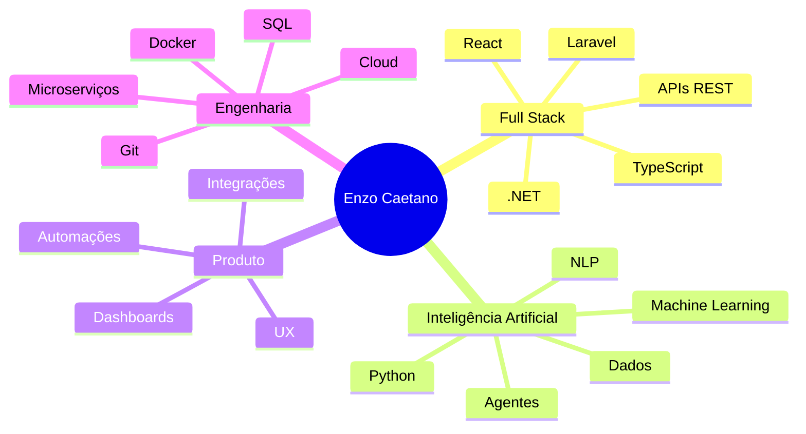

<!--
README de perfil GitHub — Enzo Caetano
Cole este conteúdo no README.md do repositório EnzoCaetano015/EnzoCaetano015
-->

<div align="center">


<br />


<br />
<br />

<a href="https://www.caetanodev.com/">
  
</a>
<a href="https://www.linkedin.com/in/enzo-caetano-814736290/">
  
</a>
<a href="mailto:peracioenzo@gmail.com">
  
</a>
<a href="https://github.com/EnzoCaetano015">
  
</a>

</div>

---

## ⚡ Sobre mim

```txt
┌──(enzo@caetanodev)-[~/profile]
│
├─ Desenvolvedor Full Stack Jr. criando soluções web, APIs e automações.
├─ Estudante de Inteligência Artificial na FIAP.
├─ Experiência prática com React, TypeScript, .NET, Python, PHP/Laravel e SQL.
├─ Interesse forte em IA aplicada, dados, microserviços, seguros e produtos digitais.
└─ Objetivo: transformar problemas reais em sistemas úteis, claros e escaláveis.
```

Sou um desenvolvedor em evolução constante, com foco em construir aplicações que conectam **frontend bem estruturado**, **backend organizado**, **dados bem tratados** e **Inteligência Artificial aplicada de forma prática**.

Gosto de projetos que saem do conceito e viram produto: dashboards, plataformas web, APIs, automações, integrações, sistemas internos, soluções educacionais, agrotech, seguros e ferramentas com impacto real.

---

## 🧭 Minha stack em modo mapa

<table>
  <tr>
    <td width="33%" valign="top">
      <h3>🎨 Frontend</h3>
      <p>
        
      </p>
      <p>Interfaces modernas, componentização, consumo de APIs, rotas, formulários, estados, dashboards e experiência de usuário.</p>
    </td>
    <td width="33%" valign="top">
      <h3>⚙️ Backend</h3>
      <p>
        
      </p>
      <p>APIs REST, autenticação, regras de negócio, integrações, microserviços, jobs, validações e arquitetura por camadas.</p>
    </td>
    <td width="33%" valign="top">
      <h3>🧠 Dados & IA</h3>
      <p>
        
      </p>
      <p>Análise de dados, modelos preditivos, NLP, dashboards, automações, machine learning e projetos acadêmicos aplicados.</p>
    </td>
  </tr>
</table>

<div align="center">


</div>

---

## 🏁 Bandeiras que eu carrego no código

<table>
  <tr>
    <td align="center" width="25%">
      <h3>🇧🇷 Produto real</h3>
      <p>Sistemas pensados para uso prático, não só para funcionar no localhost.</p>
    </td>
    <td align="center" width="25%">
      <h3>🧩 Código organizado</h3>
      <p>Separação de responsabilidades, componentes reutilizáveis e arquitetura clara.</p>
    </td>
    <td align="center" width="25%">
      <h3>🤖 IA aplicada</h3>
      <p>Uso de dados, automação, NLP e modelos para resolver problemas concretos.</p>
    </td>
    <td align="center" width="25%">
      <h3>🚀 Evolução constante</h3>
      <p>Projetos melhorando sprint a sprint, README a README, entrega a entrega.</p>
    </td>
  </tr>
</table>

---

## 🧪 Laboratório de projetos

<table>
  <tr>
    <td width="50%" valign="top">
      <h3>🎟️ Easy Rifas</h3>
      <p>Plataforma web para criação, gestão e compartilhamento de campanhas, com frontend em React e backend em ASP.NET Core.</p>
      <p>
        
        
        
      </p>
    </td>
    <td width="50%" valign="top">
      <h3>🧠 MIMIMI</h3>
      <p>Plataforma educacional de bem-estar emocional com chatbot, análise de sentimentos, dashboard e processamento de frases por turma.</p>
      <p>
        
        
        
      </p>
    </td>
  </tr>
  <tr>
    <td width="50%" valign="top">
      <h3>🌱 FarmTech / SpaceAgro</h3>
      <p>Projetos FIAP com IoT, dados, sensores, dashboards, modelos preditivos e recomendações agrícolas inteligentes.</p>
      <p>
        
        
        
      </p>
    </td>
    <td width="50%" valign="top">
      <h3>📱 FETEPS App</h3>
      <p>Aplicativo mobile oficial da FETEPS, desenvolvido em Flutter e Dart, com mapa, ODS, login, cadastro e páginas institucionais.</p>
      <p>
        
        
      </p>
    </td>
  </tr>
</table>

---

## 🛰️ Radar técnico atual



---

## 📊 Métricas do cockpit

<div align="center">


<br />


<br />


</div>

---

## 🧱 Minha forma de construir

```txt
Ideia
  ↓
Entendimento do problema
  ↓
Modelagem do fluxo
  ↓
Frontend claro + Backend seguro
  ↓
Banco organizado + API bem definida
  ↓
Teste, ajuste, documentação
  ↓
Projeto pronto para ser apresentado, usado e evoluído
```

---

## 🎯 Agora estou evoluindo em

- Arquitetura de APIs com **.NET**, autenticação, cookies HttpOnly e regras de domínio.
- Aplicações com **React**, **TypeScript**, **Material UI**, **React Query** e formulários robustos.
- Projetos de **IA aplicada**, análise de dados, NLP, dashboards e modelos preditivos.
- Integração entre sistemas, banco de dados, serviços externos e automações.
- Documentação técnica clara para transformar repositórios em portfólio profissional.

---

## 🌎 Idiomas

<div align="center">

| Idioma | Nível | Contexto |
|---|---:|---|
| 🇧🇷 Português | Nativo | Comunicação técnica, documentação e apresentações |
| 🇺🇸 Inglês | B2 | Certificação PEIC, leitura técnica e comunicação profissional |

</div>

---

## 📫 Onde me encontrar

<div align="center">

<a href="https://www.caetanodev.com/">
  
</a>
<a href="https://www.linkedin.com/in/enzo-caetano-814736290/">
  
</a>
<a href="mailto:peracioenzo@gmail.com">
  
</a>
<a href="https://www.instagram.com/caetanokskj/">
  
</a>

</div>

---

<div align="center">

### `while (aprendendo) { construir(); melhorar(); compartilhar(); }`


</div>
