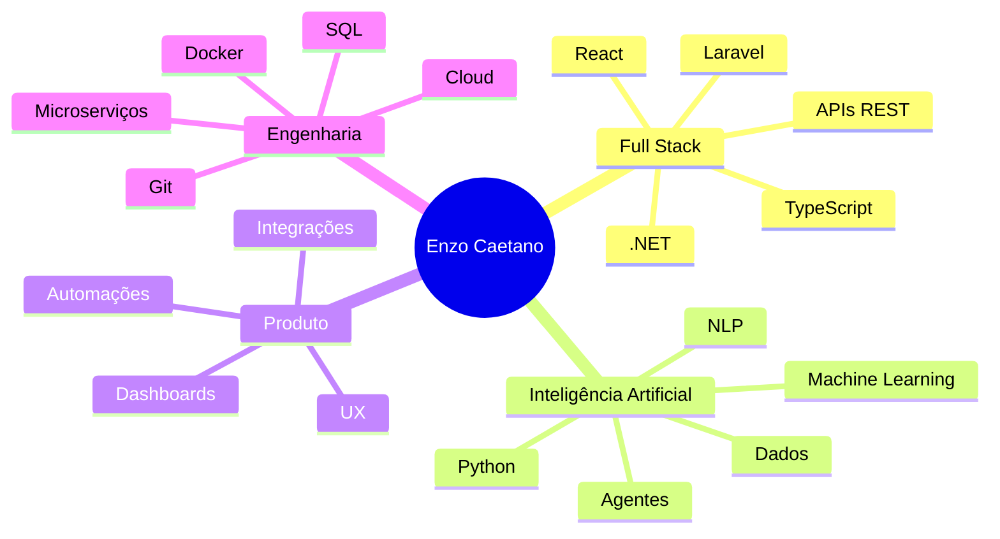
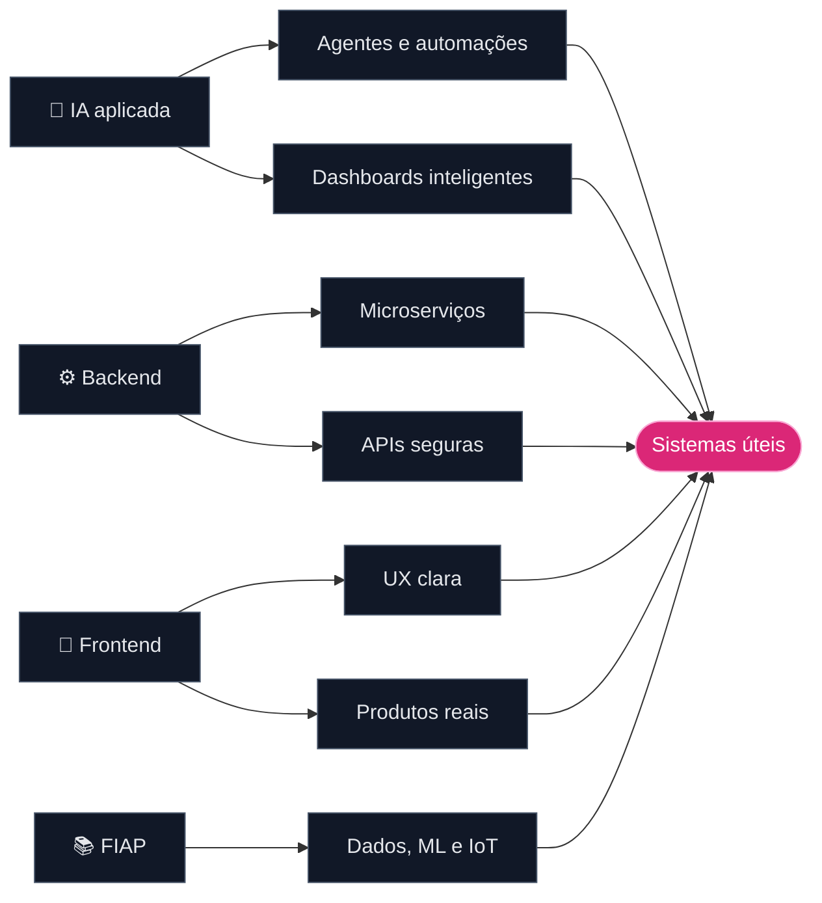

 
 

 
 

---

## ⚡ Sobre mim

<table>
<tr>
<td width="33%" align="center">

### 🧠 Penso como produto
Antes de codar, eu entendo o problema, o usuário, o fluxo e o impacto da solução.

</td>
<td width="33%" align="center">

### 🧩 Construo ponta a ponta
Crio interfaces, APIs, integrações, banco de dados e automações com foco em clareza e manutenção.

</td>
<td width="33%" align="center">

### 🚀 Entrego com evolução
Gosto de transformar ideias em projetos apresentáveis, documentados e prontos para crescer.

</td>
</tr>
</table>

Sou um **Desenvolvedor Full Stack.** em evolução constante, com experiência prática em **React, TypeScript, .NET, Python, PHP/Laravel, SQL, APIs, automações e Inteligência Artificial aplicada**.

Atualmente curso **Tecnólogo em Inteligência Artificial pela FIAP** e uso meus projetos para unir desenvolvimento web, dados, IA, integrações e resolução de problemas reais.

---

## 🧭 Minha stack em modo mapa

<table>
  <tr>
    <td width="33%" valign="top">
      <h3>🎨 Frontend</h3>
      

        
      

      
Interfaces modernas, componentização, consumo de APIs, rotas, formulários, estados, dashboards e experiência de usuário.

    </td>
    <td width="33%" valign="top">
      <h3>⚙️ Backend</h3>
      

        
      

      
APIs REST, autenticação, regras de negócio, integrações, microserviços, jobs, validações e arquitetura por camadas.

    </td>
    <td width="33%" valign="top">
      <h3>🧠 Dados & IA</h3>
      

        
      

      
Análise de dados, modelos preditivos, NLP, dashboards, automações, machine learning e projetos acadêmicos aplicados.

    </td>
  </tr>
</table>

---

## 🛰️ Radar técnico atual

---

## 📊 Métricas do cockpit

 
 

---

## 🧱 Minha forma de construir

---

## 🌎 Idiomas

| Idioma | Nível | Contexto |
|---|---:|---|
| 🇧🇷 Português | Nativo | Comunicação técnica, documentação e apresentações |
| 🇺🇸 Inglês | B2 | Certificação PEIC, leitura técnica e comunicação profissional |

---

### `while (aprendendo) { construir(); melhorar(); compartilhar(); }`

